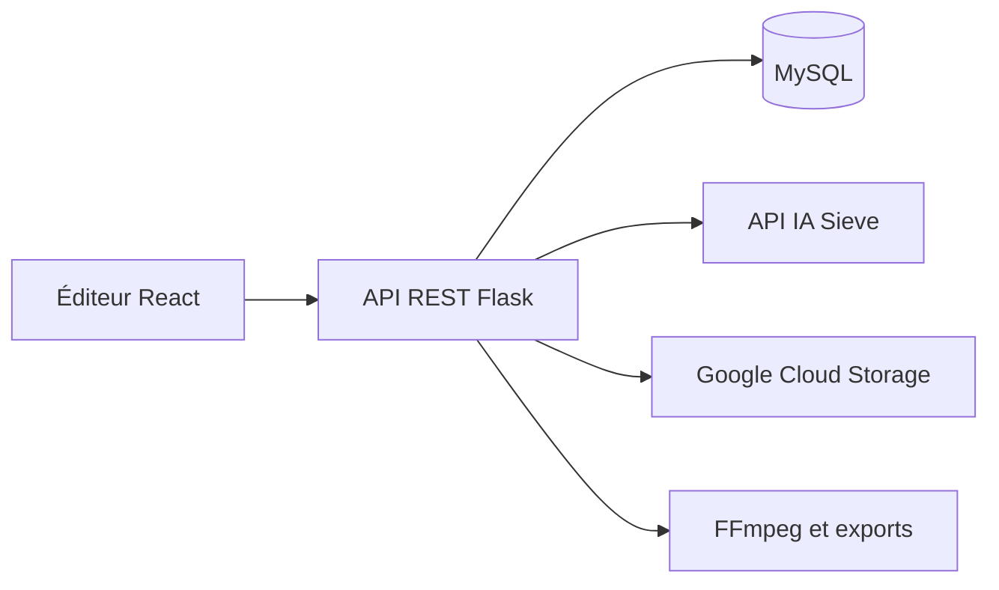

# Sumfy

**Plateforme web de montage audio et vidéo assistée par IA**

Sumfy permet de préparer, doubler et corriger des contenus audio et vidéo depuis un navigateur. J’ai cofondé le produit et assuré seul son développement technique, de l’éditeur web aux traitements serveur et au déploiement.

Ce dépôt présente le produit et les choix techniques. Le code source reste privé.

## Fonctionnalités

- Éditeur web avec découpage des médias et correction des transcriptions.
- Doublage, synthèse vocale et synchronisation labiale par API IA.
- Séparation de la voix et du fond sonore.
- Correction et régénération de segments audio.
- Export audio et vidéo avec FFmpeg.
- Comptes utilisateurs et gestion des abonnements Stripe.

## Mon rôle

- Conception et développement de l’interface React.
- Développement de l’API REST Python / Flask et de la couche de données MySQL.
- Intégration des traitements IA via Sieve, notamment les capacités vocales ElevenLabs.
- Organisation des traitements longs, stockage des médias et déploiement sur VPS Linux.

## Architecture

## Choix techniques

**Traitements longs.** Les médias sont découpés en segments et traités en parallèle, avec jusqu’à dix tâches simultanées. Le serveur suit l’état des jobs et gère les délais d’attente et les erreurs réseau.

**Accès aux médias.** Les fichiers sont stockés dans Google Cloud Storage et accessibles par URL signées. L’API utilise une authentification JWT.

**Contrôle utilisateur.** L’utilisateur peut modifier les transcriptions et régénérer des segments avant l’export final.

## Stack

| Couche | Technologies |
| --- | --- |
| Interface | React, JavaScript |
| API | Python, Flask, REST, JWT |
| Données | MySQL |
| IA | Sieve, capacités vocales ElevenLabs |
| Médias | FFmpeg, pydub |
| Stockage et déploiement | Google Cloud Storage, VPS Linux |

## Présentation du projet

Produit développé et commercialisé auprès de clients professionnels. Cette présentation décrit les fonctionnalités réalisées ; elle ne fournit pas une version installable.

---

Projet cofondé et développé par [Jorian Gaurin](https://github.com/jgaurin) · [LinkedIn](https://www.linkedin.com/in/jorian-gaurin)
